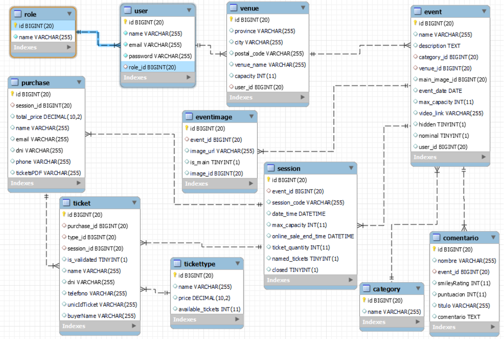
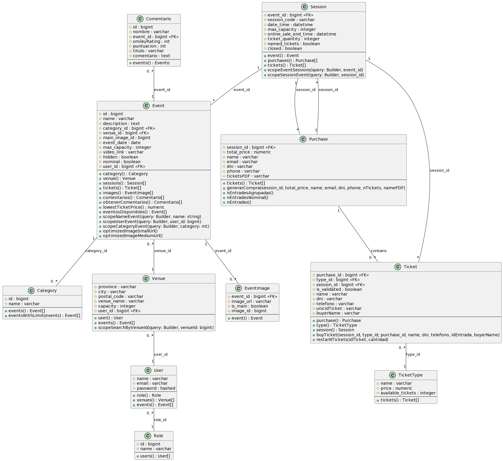

= EventoPass
:doctype: book
:chapter-label:
:sectnums:
:toc: left
:toclevels: 6
:toc-title: Table of Contents
:front-cover-image: image::images/logo.png[]

== Autores

* link:https://portfolio.alfredperez.com[Alfred Perez]
* link:https://portfolio.ferrancarmona.com[Ferran Carmona]
* link:https://portfolio.guiupuigantell.com[Guiu Puigantell]

== Objectiu de l'Aplicació
El projecte té com a objectiu principal el desenvolupament d'un portal web innovador destinat a la venda d'entrades per a esdeveniments variats. Aquesta plataforma es concep com un eina clau per als promotors d'esdeveniments, oferint-los la capacitat de gestionar la venda d'entrades i la publicació dels seus esdeveniments de manera eficient i centralitzada.

La plataforma es diferenciarà per les següents característiques:

. *Venda d'Entrades*: Facilitarà la compra d'entrades de manera segura i fiable, satisfent les necessitats tant dels promotors com dels assistents.
. *Gestió d'Esdeveniments pels Promotors*: Permetrà als promotors publicar i gestionar els seus esdeveniments, creant una experiència personalitzada i adaptada a les seves necessitats.
. *Model de Negoci*: Implementarà un model de negoci basat en un percentatge sobre les vendes de cada entrada, assegurant un benefici mutu entre la plataforma i els promotors.
. *Validació d'Entrades*: A través d'una aplicació web independent, es proporcionarà una solució per a la validació eficient d'entrades en l'entrada dels esdeveniments, garantint una gestió segura i ràpida.

Aquesta plataforma no només respondrà a una necessitat de mercat actual, sinó que també aportarà valor afegit als seus usuaris, facilitant una experiència d'usuari millorada i eficient tant per als promotors com per als assistents dels esdeveniments.

== Disseny de Base de Dades

El disseny de la base de dades per al portal web es basa en diverses taules interconnectades que garanteixen una gestió eficient de les dades dels esdeveniments. Aquestes taules principals són `categories`, `events`, `venues`, `sessions`, `purchases`, `users`, `ticket_types` i `tickets`. A continuació, es detallen aquestes taules i les seves relacions.

== Taules de la Base de Dades EventoPass

=== Venues

[cols="2,5,3"]
|===
| Camp | Descripció | Tipus de Dada

| `id`
| Identificador únic per a cada venue (recinte)
| `bigIncrements`

| `province`
| Província on es troba el venue
| `string(255)`

| `city`
| Ciutat on es troba el venue
| `string(255)`

| `postal_code`
| Codi postal del venue
| `string(255)`

| `venue_name`
| Nom del venue
| `string(255)`

| `capacity`
| Capacitat màxima del venue
| `integer`

| `user_id`
| Clau forana que referència a l'usuari propietari del venue
| `unsignedBigInteger`, clau forana referència `id` en `users`

| `created_at` i `updated_at`
| Camps automàtics per a registrar les dates de creació i última actualització
| `timestamps`
|===

=== Users

[cols="2,5,3"]
|===
| Camp | Descripció | Tipus de Dada

| `id`
| Identificador únic per a cada usuari
| `id()`

| `name`
| Nom de l'usuari
| `string`

| `email`
| Correu electrònic de l'usuari, ha de ser únic
| `string`, únic

| `email_verified_at`
| Data i hora de la verificació del correu electrònic, pot ser nul·la
| `timestamp`, nullable

| `password`
| Contrasenya de l'usuari
| `string`

| `rememberToken`
| Token per a recordar la sessió de l'usuari
| `rememberToken()`

| `created_at` i `updated_at`
| Camps automàtics per a registrar les dates de creació i última actualització de l'usuari
| `timestamps`
|===

=== Categories

[cols="2,5,3"]
|===
| Camp | Descripció | Tipus de Dada

| `id`
| Identificador únic per a cada categoria
| `bigIncrements`

| `name`
| Nom de la categoria
| `string(255)`

| `created_at` i `updated_at`
| Camps automàtics per a registrar les dates de creació i última actualització del registre
| `timestamps`
|===

=== Events

[cols="2,5,3"]
|===
| Camp | Descripció | Tipus de Dada

| `id`
| Identificador únic per a cada esdeveniment
| `bigIncrements`

| `name`
| Nom de l'esdeveniment
| `string(255)`

| `description`
| Descripció de l'esdeveniment
| `text`

| `main_image_id`
| ID de la imatge principal de l'esdeveniment, pot ser null, vincula amb la BD de la API d'imatges
| `unsignedBigInteger`, nullable

| `category_id`
| Clau forana que referència a la categoria de l'esdeveniment
| `unsignedBigInteger`

| `venue_id`
| Clau forana que referència al recinte on es realitza l'esdeveniment
| `unsignedBigInteger`

| `user_id`
| Clau forana que referència a l'usuari creador de l'esdeveniment, pot ser null
| `unsignedBigInteger`, nullable

| `event_date`
| Data i hora de l'esdeveniment, pot ser null
| `timestamp`, nullable

| `video_link`
| Enllaç al vídeo relacionat amb l'esdeveniment, pot ser null
| `string(255)`, nullable

| `hidden`
| Indica si l'esdeveniment està ocult o no
| `boolean`, default false

| `nominal`
| Indica si l'esdeveniment és nominal o no
| `boolean`, default false

| `created_at` i `updated_at`
| Camps automàtics per a registrar les dates de creació i última actualització del registre
| `timestamps`

|===

=== Sessions

[cols="2,5,3"]
|===
| Camp | Descripció | Tipus de Dada

| `id`
| Identificador únic per a cada sessió
| `bigIncrements`

| `event_id`
| Clau forana que referència a l'esdeveniment associat
| `unsignedBigInteger`

| `session_code`
| Codi únic de la sessió, pot ser null
| `string`, únic, nullable

| `date_time`
| Data i hora de la sessió
| `timestamp`

| `max_capacity`
| Capacitat màxima de la sessió, pot ser null
| `integer`, nullable

| `online_sale_end_time`
| Temps final per la venda online de tiquets, pot ser null
| `timestamp`, nullable

| `ticket_quantity`
| Quantitat de tiquets disponibles, pot ser null
| `integer`, nullable

| `named_tickets`
| Indica si els tiquets són nominals
| `boolean`, default false

| `closed`
| Indica si la sessió està tancada
| `boolean`, default false

| `created_at` i `updated_at`
| Camps automàtics per a registrar les dates de creació i última actualització del registre
| `timestamps`

|===

=== Ticket_Types

[cols="2,5,3"]
|===
| Camp | Descripció | Tipus de Dada

| `id`
| Identificador únic per a cada tipus de tiquet
| `bigIncrements`

| `name`
| Nom del tipus de tiquet
| `string(255)`

| `price`
| Preu del tiquet
| `decimal(8,2)`

| `available_tickets`
| Tiquets disponibles per aquest tipus, pot ser null
| `integer`, nullable

| `created_at` i `updated_at`
| Camps automàtics per a registrar les dates de creació i última actualització del registre
| `timestamps`

|===

=== Purchases

[cols="2,5,3"]
|===
| Camp | Descripció | Tipus de Dada

| `id`
| Identificador únic per a cada compra
| `bigIncrements`

| `session_id`
| Clau forana que referència a la sessió associada a la compra
| `unsignedBigInteger`

| `name`
| Nom de la persona que realitza la compra
| `string`

| `dni`
| Document Nacional d'Identitat de la persona que realitza la compra
| `string`

| `phone`
| Telèfon de contacte de la persona que realitza la compra
| `integer`

| `email`
| Correu electrònic de la persona que realitza la compra
| `string`

| `total_price`
| Preu total de la compra
| `decimal(8,2)`

| `ticketsPDF`
| Enllaç al PDF dels tiquets de la compra, pot ser null
| `string`, nullable

| `created_at` i `updated_at`
| Camps automàtics per a registrar les dates de creació i última actualització del registre
| `timestamps`

|===

=== Tickets

[cols="2,5,3"]
|===
| Camp | Descripció | Tipus de Dada

| `id`
| Identificador únic per a cada tiquet
| `bigIncrements`

| `is_validated`
| Indica si el tiquet ha estat validat
| `boolean`, default false

| `purchase_id`
| Clau forana que referència a la compra associada, pot ser null
| `unsignedBigInteger`, nullable

| `type_id`
| Clau forana que referència al tipus de tiquet
| `unsignedBigInteger`

| `session_id`
| Clau forana que referència a la sessió associada
| `unsignedBigInteger`

| `name`
| Nom de la persona titular del tiquet, pot ser null
| `string(255)`, nullable

| `dni`
| Document Nacional d'Identitat de la persona titular del tiquet, pot ser null
| `string(255)`, nullable

| `telefono`
| Telèfon de contacte de la persona titular del tiquet, pot ser null
| `string(255)`, nullable

| `unicIdTicket`
| Identificador únic del tiquet, pot ser null
| `string(255)`, nullable

| `buyerName`
| Nom de la persona que ha fet la compra, pot ser null
| `string(255)`, nullable

| `created_at` i `updated_at`
| Camps automàtics per a registrar les dates de creació i última actualització del registre
| `timestamps`

|===

=== Roles

[cols="2,5,3"]
|===
| Camp | Descripció | Tipus de Dada

| `id`
| Identificador únic per a cada rol
| `id`

| `name`
| Nom del rol, ha de ser únic
| `string`, únic

| `created_at` i `updated_at`
| Camps automàtics per a registrar les dates de creació i última actualització del registre
| `timestamps`

|===

=== Event_Images

[cols="2,5,3"]
|===
| Camp | Descripció | Tipus de Dada

| `id`
| Identificador únic per a cada imatge d'esdeveniment
| `bigIncrements`

| `event_id`
| Clau forana que referència a l'esdeveniment associat
| `unsignedBigInteger`

| `image_id`
| Identificador de la imatge
| `string`

| `is_main`
| Indica si la imatge és la principal de l'esdeveniment
| `boolean`, default false

| `created_at` i `updated_at`
| Camps automàtics per a registrar les dates de creació i última actualització del registre
| `timestamps`

|===

=== Comentaris

[cols="2,5,3"]
|===
| Camp | Descripció | Tipus de Dada

| `id`
| Identificador únic per a cada comentari
| `bigIncrements`

| `event_id`
| Clau forana que referència a l'esdeveniment associat
| `unsignedBigInteger`

| `nombre`
| Nom de la persona que fa el comentari
| `string`

| `smileyRating`
| Valoració amb emoticones, pot ser null
| `integer`, nullable

| `puntuacion`
| Puntuació numèrica del comentari
| `integer`

| `titulo`
| Títol del comentari
| `string`

| `comentario`
| Text del comentari
| `text`

| `created_at` i `updated_at`
| Camps automàtics per a registrar les dates de creació i última actualització del registre
| `timestamps`

|===

== Taules de la Base de Dades de la API Imatges

=== Images

[cols="2,5,3"]
|===
| Camp | Descripció | Tipus de Dada

| `id`
| Identificador únic per a cada imatge
| `bigIncrements`

| `name`
| Nom de la imatge
| `string`

| `created_at` i `updated_at`
| Camps automàtics per a registrar les dates de creació i última actualització del registre
| `timestamps`
|===

=== Optimized_Images

[cols="2,5,3"]
|===
| Camp | Descripció | Tipus de Dada

| `id`
| Identificador únic per a cada imatge optimitzada
| `bigIncrements`

| `image_id`
| Clau forana que referència a la imatge original
| `unsignedBigInteger`

| `version`
| Versió de la imatge optimitzada
| `string`

| `path`
| Camí on es guarda la imatge optimitzada
| `string`

| `url`
| URL on es pot accedir a la imatge optimitzada
| `string`

| `created_at` i `updated_at`
| Camps automàtics per a registrar les dates de creació i última actualització del registre
| `timestamps`

|===

== Sketching i Mockup d'Interfícies
https://www.figma.com/file/FqrK3TnRAHJla14AuuZgMQ/Grupo4-Puigantell-Carmona-Perez-team-library?type=design&node-id=0-1&mode=design&t=g8761nKUwxHuE5S8-0

== Manual d'Instal·lació/Distribució
Pas a pas detallat de com instal·lar i distribuir l'aplicació.

=== Diagrama de xarxa:

=== Instal·lació del apache2:
Fem un update -> sudo apt update

Instal·lem l'apache2 -> sudo apt install apache2

I el podem engegar -> sudo systemctl enable apache2

=== Preparació del servidor:

Primer de tot fem un clone el nostre repositori de git en la ruta /var/www/html --> sudo git clone https://git.copernic.cat/gpuigantell/gr04-puigantell-carmona-perez.git

Dins de cd /var/www/html/gr04-puigantell-carmona-perez/Eventopass y dins de cd /var/www/html/gr04-puigantell-carmona-perez/Api realitzem aqueste 4 comandes.

Ara instal·lem les dependències del composer -> sudo composer install

Copiem el fitxer .env.example amb el nom .env -> sudo cp .env.example .env

I creem la key del Artisan -> sudo php artisan key:generate

I fem el link simbòlic del public i el storage -> sudo php artisan storage:link

=== Creació del docker:
Instal·lem les dependencies del Docker -> sudo apt install apt-transport-https ca-certificates curl gnupg lsb-release

Afegim la clau GPG oficial del Docker -> curl -fsSL https://download.docker.com/linux/debian/gpg | sudo gpg --dearmor -o /usr/share/keyrings/docker-archive-keyring.gpg

Configurem el repositori de Docker -> echo "deb [signed-by=/usr/share/keyrings/docker-archive-keyring.gpg] https://download.docker.com/linux/debian $(lsb_release -cs) stable" | sudo tee /etc/apt/sources.list.d/docker.list > /dev/null

Fem un update -> sudo apt update

Instal·lem el Docker CE -> sudo apt install docker-ce docker-ce-cli containerd.io

Instal·lem el docker compose -> sudo curl -L "https://github.com/docker/compose/releases/download/VERSION/docker-compose-$(uname -s)-$(uname -m)" -o /usr/local/bin/docker-compose

I li donem permisos -> sudo chmod +x /usr/local/bin/docker-compose

Ara hem de crear el fitxer docker-compose.yml, aixi que anem a la ubicació del EventoPass, que hauria de ser -> cd /var/www/html/gr04-puigantell-carmona-perez/EventoPass

Dins d'aquesta carpeta creem el fitxer -> sudo nano docker-compose.yml

[source,yaml]
----

version: '3'

services:
  mi_postgres:
    image: postgres:latest
    container_name: mi_postgres
    environment:
      POSTGRES_USER: postgres
      POSTGRES_PASSWORD: 1234
      POSTGRES_DB: basededatos
    ports:
      - "5555:5432"

  postgres_api:
    image: postgres:latest
    container_name: postgres_api
    environment:
      POSTGRES_USER: postgres
      POSTGRES_PASSWORD: 1234
      POSTGRES_DB: apibd
    ports:
      - "5554:5432"

----

Ara hem d'editar el nostre fitxer .env

Editarem el de la carpeta EventoPass -> sudo nano /var/www/html/gr04-puigantell-carmona-perez/EventoPass/.env
Les línies que hem de revisar són: url=, URL_API=, API_PATH= i les credencials del mail.

=== Aixecament de les bases de dades:

Crearem un servei perquè les bases de dades del Docker s'aixequin sempre a l'engegar el servidor:

Primer creem el fitxer -> sudo nano /etc/systemd/system/eventoPass.service

[source, service]
----

[Unit]
Description=Lenvantar Docker Compose

[Service]
WorkingDirectory=/var/www/html/gr04-Puigantell-Carmona-Perez/EventoPass
ExecStart=/usr/local/bin/docker-compose -f /var/www/html/gr04-Puigantell-Carmona-Perez/EventoPass/docker-compose.yml up -d

----

Un cop creat executem -> "sudo systemctl daemon-reload" despres -> "sudo systemctl enable eventoPass.service" i  -> sudo systemctl start eventoPass.service

Reiniciem el servidor per activar i que s'executi el servei.

=== Configuració de servidor web:

==== EventoPass

Creem un fitxer de configuració del apache2 -> /etc/apache2/sites-available/eventoPass.conf

Configurem el fitxer amb les nostres rutes i ips:

[source,apache]
----
<VirtualHost *:80>
    ServerName 192.168.60.130
    DocumentRoot /var/www/html/gr04-Puigantell-Carmona-Perez/EventoPass/public

    <Directory /var/www/html/gr04-Puigantell-Carmona-Perez/EventoPass>
        Options Indexes FollowSymLinks
        AllowOverride All
        Require all granted
    </Directory>

</VirtualHost>
----

Habilitem el nostre virtual host -> sudo a2ensite eventoPass.conf
Reiniciem el servei apache2 -> sudo systemctl restart apache2

==== API

Creem un fitxer de configuració del apache2 -> /etc/apache2/sites-available/api.conf

Configurem el fitxer amb les nostres rutes i ips:

[source,apache]
----
<VirtualHost *:8080>
    ServerName 192.168.60.130
    DocumentRoot /var/www/html/gr04-Puigantell-Carmona-Perez/API/public

    <Directory /var/www/html/gr04-Puigantell-Carmona-Perez/API>
        Options Indexes FollowSymLinks
        AllowOverride All
        Require all granted
    </Directory>

</VirtualHost>
----

Habilitem el nostre virtual host -> sudo a2ensite eventoPass.conf
Reiniciem el servei apache2 -> sudo systemctl restart apache2

I habilitem perquè apache pugui escoltar en el port 8080:

sudo nano /etc/apache2/ports.conf

Aquí afegim -> Listen 8080

== Documentació de Permisos
Descripció detallada dels permisos necessaris per a components, programes, contenidors, etc.

Hem de donar permisos a la carpeta de logs, framework i public amb aquestes tres comandes -> sudo chown -R www-data:www-data /var/www/html/gr04-Puigantell-Carmona-Perez/EventoPass/storage/framework , sudo chown -R www-data:www-data /var/www/html/gr04-Puigantell-Carmona-Perez/EventoPass/storage/logs y sudo chown -R www-data:www-data /var/www/html/gr04-Puigantell-Carmona-Perez/EventoPass/public

tambe hem de fer le mateix amb l'API -> sudo chown -R www-data:www-data /var/www/html/gr04-Puigantell-Carmona-Perez/API/storage/framework , sudo chown -R www-data:www-data /var/www/html/gr04-Puigantell-Carmona-Perez/API/storage/logs y sudo chown -R www-data:www-data /var/www/html/gr04-Puigantell-Carmona-Perez/API/public

Per acabar anem  la ruta de l'API -> cd /var/www/html/gr04-Puigantell-Carmona-Perez/API y dins executem -> sudo php artisan migrate:refresh

Fem el mateix en EventoPass -> cd /var/www/html/gr04-Puigantell-Carmona-Perez/EventoPass y dins executem -> sudo php artisan migrate:refresh

I ja tindriem el nostre servidor operatiu.

== Instal·lació del DomPDF

Primer instal·lem el paquet DomPdf amb el composer --> composer require barryvdh/laravel-dompdf

En l'arxiu config/app.php a l'apartat de 'provaiders' fiquem la següent línia --> Barryvdh\DomPDF\ServiceProvider::class

I publiquem el paquet per a poder modificar-lo --> php artisan vendor:publish --provider="Barryvdh\DomPDF\ServiceProvider"

== Descripció General de l'API

L'API de Gestió d'Imatges permet la càrrega, optimització i gestió d'imatges. Aquesta API és accessible a través de la base URL `http://localhost:8080/api/V1` i està dissenyada per oferir una forma eficient de manejar imatges en aplicacions web i mòbils.

=== Informació General

- *Títol:* Image Management API
- *Descripció:* API per a la càrrega, optimització, i gestió d'imatges.
- *Versió:* 1.0.0

=== Servidors

- URL: http://localhost:8080/api/V1
- Descripció: URL base de l'API

=== Rutes de l'API

==== Operacions sobre Imatges `/images`

===== GET

.Llista totes les imatges.
* Resum: Retorna una llista de totes les imatges disponibles.
* Respostes:
** `200`: Llista d'imatges obtinguda amb èxit.
+
.Content-type: `application/json`
+
.Esquema:
+
[source,json]
----
{
  "type": "array",
  "items": {
    "type": "object",
    "properties": {
      "id": {
        "type": "integer",
        "example": 1
      },
      "name": {
        "type": "string",
        "example": "image.jpg"
      }
    }
  }
}
----

===== POST

.Carrega una nova imatge i crea les seves versions optimitzades.
* Resum: Permet la càrrega d'una nova imatge.
* RequestBody: Requerit, `multipart/form-data`.
* Respostes:
** `201`: Imatge carregada i optimitzada correctament.
** `400`: Sol·licitud invàlida.
** `415`: Tipus de mitjà no suportat.
** `500`: Error intern del servidor.

==== Operacions sobre una Imatge Específica `/images/{id}`

===== GET

.Obté una imatge específica pel seu ID.
* Resum: Retorna una imatge específica.
* Paràmetres: `id` - El ID de la imatge a obtenir.
* Respostes:
** `200`: Imatge obtinguda amb èxit.
** `404`: Imatge no trobada.

===== DELETE

.Elimina una imatge específica i les seves versions optimitzades.
* Resum: Elimina la imatge especificada pel ID.
* Paràmetres: `id` - El ID de la imatge a eliminar.
* Respostes:
** `204`: Imatge eliminada amb èxit.
** `404`: Imatge no trobada.

===== POST

.Actualitza una imatge específica i les seves versions optimitzades.
* Resum: Actualitza la imatge especificada pel ID.
* RequestBody: Requerit, `multipart/form-data`.
* Respostes:
** `200`: Imatge actualitzada amb èxit.
** `400`: Sol·licitud invàlida.
** `404`: Imatge no trobada.
** `415`: Tipus de mitjà no suportat.
** `500`: Error intern del servidor.

==== Operacions sobre Imatges Optimitzades
`/optimized-images/{image_id}/{version}`

===== GET

.Obté una versió optimitzada específica d'una imatge.
* Resum: Retorna una versió optimitzada de la imatge.
* Paràmetres:
** `image_id` - El ID de la imatge.
** `version` - La versió de la imatge optimitzada a obtenir (small, medium, large).
* Respostes:
** `200`: Versió optimitzada de la imatge obtinguda amb èxit.
** `404`: Imatge o versió optimitzada no trobada.
** `500`: Error intern del servidor.

== Autenticació

=== Token d'Aplicació

.La verificació del token de l'aplicació és requerida per a realitzar operacions d'escriptura.
* Headers requerits per a les operacions POST, DELETE, i POST sobre `/images/{id}`:
** `Authorization: Bearer {app_token}`

== Codis d'Estat d'Error Comuns

* `400` - Sol·licitud invàlida. Pot ser degut a dades d'entrada incorrectes.
* `404` - Recurs no trobat. L'ID especificat no correspon a cap recurs existent.
* `415` - Tipus de mitjà no suportat. L'arxiu carregat no és una imatge o supera la mida màxima permesa.
* `500` - Error intern del servidor. Error inesperat en el servidor.

== API de Validació de Tickets

La API de Validació de Tickets permet la verificació de codis de sessió i la validació de tickets dins de sessions específiques. Aquesta API és part del sistema de gestió de tickets i proporciona una interfície per a la validació segura i eficient dels tickets.

=== Rutes de l'API

=== Validació de Sessió `/login`

==== POST

.Login amb codi de sessió.
* Resum: Maneja el procés de login verificant el codi de sessió. Permet el login si la sessió amb el codi proporcionat està tancada.
* Paràmetres de la sol·licitud: `session_code` - Requerit, codi de la sessió a verificar.
* Headers requerits: No aplica.
* Respostes:
** `200`: Login exitós.
** `401`: Codi de sessió invàlid o la sessió no està tancada per a nous logins.
+
.Content-type: `application/json`
+
.Esquema de la resposta:
+
[source,json]
----
{
  "success": true,
  "message": "Login exitoso.",
  "session_code": "CODI_DE_SESSIÓ"
}
----

=== Validació de Ticket `/tickets/validate/{sessionId}/{hash}`

==== GET

.Obté informació i valida un ticket.
* Resum: Obtiene la información de un ticket basado en el ID de sesión y un hash único. Valida si el ticket aún no ha sido validado y, de ser así, lo marca como validado.
* Paràmetres de la sol·licitud:
** `sessionId` - Identificador de la sessió.
** `hash` - Hash únic del ticket.
* Headers requerits: `Session-Code` - Codi de sessió per a la verificació de la sessió actual.
* Respostes:
** `200`: Ticket validat correctament.
** `403`: La sessió no coincideix o no es va trobar.
** `404`: Ticket no trobat.
** `409`: El ticket ja ha estat validat.
+
.Content-type: `application/json`
+
.Esquema de la resposta:
+
[source,json]
----
{
  "success": true,
  "message": "Ticket validado correctamente.",
  "ticket_info": {
    "name": "NOM_DEL_PROPRIETARI",
    "dni": "DNI_DEL_PROPRIETARI",
    "phone": "TELÈFON_DEL_PROPRIETARI"
  }
}
----

== Middleware Utilitzat a l'API de Validacion de Tickets

* `verifySessionCode`: Verifica que el codi de sessió proporcionat en la capçalera de la petició sigui vàlid. Utilitzat per a totes les operacions que requereixen verificació de sessió.

== Web-grafia i Altres Recursos de Consulta

Durant el desenvolupament, s'han utilitzat diversos recursos i eines. A continuació, es detallen alguns dels més rellevants:

=== R18: Passarel·la de pagament

* *RedSys Sandbox - Versió REST:* Una plataforma per a la implementació de pagaments amb targeta de crèdit.
** URL: https://pagosonline.redsys.es/conexion-rest.html

=== R28: Càrrega de recursos optimitzada

* * i l'atribut loading:* Permet carregar imatges de manera diferida millorant el rendiment de la pàgina.
** Guia MDN: https://developer.mozilla.org/en-US/docs/Web/HTML/Element/img#attr-loading
* *<picture>:* Utilitzat per a especificar múltiples fonts d'imatge o per a oferir versions d'una imatge per a diferents dimensions de pantalla.
** Guia MDN: https://developer.mozilla.org/en-US/docs/Web/HTML/Element/picture
* *<source> i el srcset:* Permet definir diverses fonts d'imatge que el navegador pot triar entre elles basant-se en les dimensions de la pantalla i la densitat de píxels.
** Guia MDN: https://developer.mozilla.org/en-US/docs/Learn/HTML/Multimedia_and_embedding/Responsive_images

=== R29: Metadades i compartició a xarxes socials

* *Metadata en HTML:* Important per a un bon reconeixement per part dels cercadors i per a la compartició en xarxes socials.
** Article MDN: https://developer.mozilla.org/en-US/docs/Learn/HTML/Introduction_to_HTML/The_head_metadata_in_HTML

=== R30: Microservei d’optimització d’imatges

* *Docker:* Permet crear una API RESTful en un contenidor aïllant la responsabilitat del sistema.
** Web oficial: https://www.docker.com/
* *OpenAPI:* Eina per a la documentació d'APIs que facilita la descripció dels endpoints, mètodes i paràmetres.
** Web oficial: https://www.openapis.org/

=== R31: Proves de l’API amb Postman

* *Postman:* Eina per a la prova i documentació d'APIs que permet enviar peticions HTTP i revisar les respostes.
** Web oficial: https://www.postman.com/

=== R35: Creació d’aplicació per a validació d’entrades

* *Cordova:* Framework per al desenvolupament d'aplicacions mòbils utilitzant HTML, CSS i JavaScript.
** Web oficial: https://cordova.apache.org/

== Presentació del Projecte

El projecte EventoPass serà presentat mitjançant una demostració en directe on es mostraran les funcionalitats clau de la plataforma, incloent la gestió d'esdeveniments, la compra i validació d'entrades, i l'ús de l'API de gestió d'imatges.
